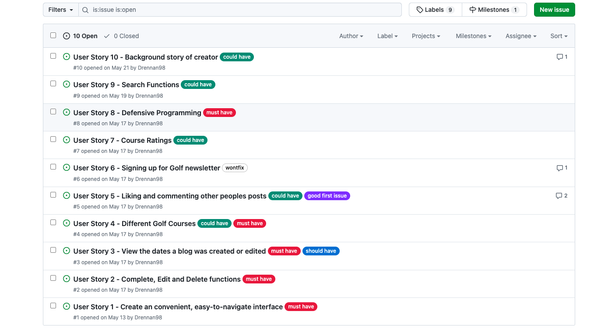
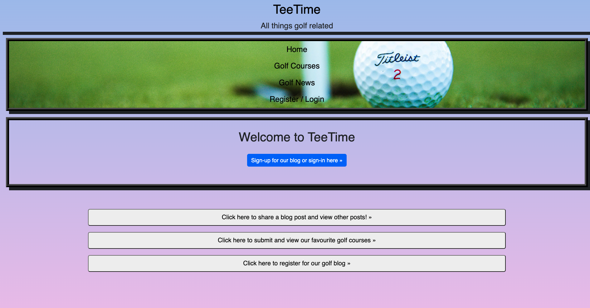
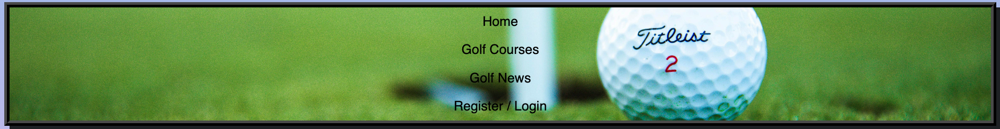
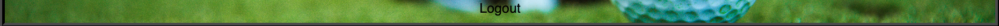
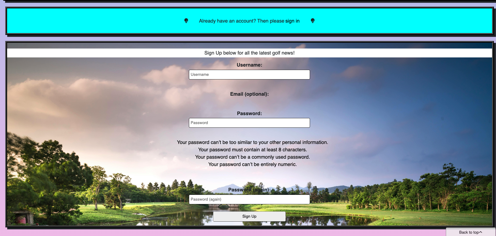
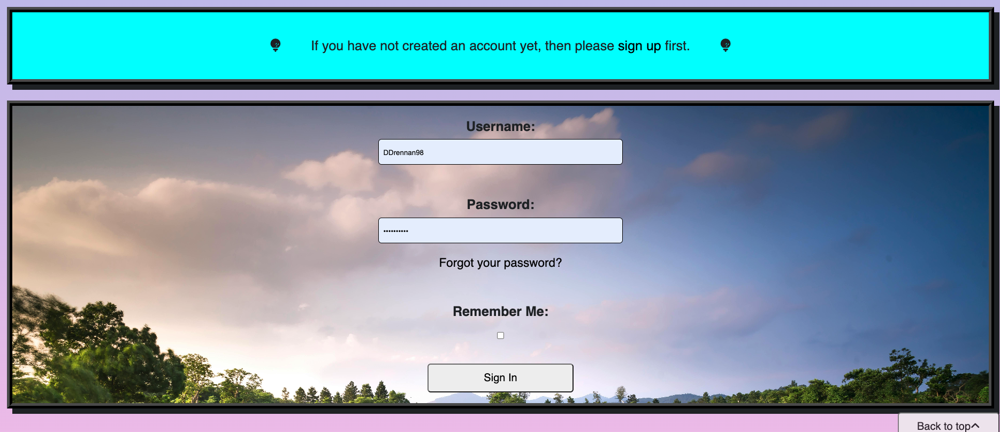

# Welcome to my site on all things golf related called TeeTime

**Insert responsiveness image here**

# Project Purpose

This is the 4th project for the diploma in Full Stack Software Development with Code Institute. TeeTime is a blog where users can interact with eachother, compare favourite golf courses and chat about all things golf. The website will offer users the ability to create, edit delete posts. They will also be able to comment on eachother posts. Think of it as Instagram or Facebook but for golfers. This is a full stack website which incorporates the Django framework. One my main goals is to get people into the game of golf so once users have engaged with content on the site.

# User Experience (UX)

## Project Goals

- Potentially get people into the game of golf. 

- Create a social network for golfers to collaborate and potentially book tee times together. 

- Become a hub for golfers to share all things golf related. 

- Allow users to create, edit and delete posts. 

- Allow users to create and delete comments. 

- Give the ability to users to register, sign in and sign out of the site. 

- Reflect the log in state to the user. 

- Create an easy to navigate, user friendly site. 

## Target Audience 

- People who might be looking to take the game of golf up. 

- Golfers of all skill levels. 

- Golfers looking for other people to play with.

# Agile Methodology 

## Epics 

- Fully functioning site.

- Easy to navigate and intuitive site. 

- A form for signing up on the website. 

- Easy to understand nav bar and also shows whether you're logged in or logged out. 

- Golf course image gallery.

- Database setup. 

## User Stories 

1. Create a convenient, easy-to-navigate interface.

2. Complete, Edit and Delete functions. 

3. Views the dates a blog post was created and edited. 

4. Different golf courses. 

5. Liking and commenting other peoples posts. 

6. Signing up for golf newsletter. 

7. Course ratings. 

8. Defensive programming. 

9. Search functions. 

10. Background story of creator. 

## MoSCoW Prioritization

- I used MoSCoW prioritization to rank how essential each feature would be. See image below for my user stories and how I labelled them. 

- Must Have labels are essential features. 

- Should Have labels indicated that these features are important but not vital. 

- Could Have labels indicate features that are desirable but not necessary.

- Wont Have labels indicate features that are least critical and will not be implemented. 

- I found that it was an efficient of managing my time and putting my time into the most important part of my project while implementing the most important features first
and working my way down the priority list. 

# Features 

## Landing Page

- The TeeTime landing page is simple and easy to navigate. The buttons are big and bright and describe the function of each clearly. The user will have the ability to register an account, sign in with their details, submit one of their favourite golf courses and even share a blog post (note: the user must be signed in to share a post). 

## Navbar and Navbar links

- The TeeTime navbar contains all the navigation links for the different parts of the application. **Home** directs the user to the home page (quick tip: Clicking on **TeeTime** also redirects the user to the home page), **Golf Courses** will direct the user to the golf course submission form where the user can share there favourite golf courses and delete the ones that they don't like. They can also view a list of submitted golf courses. **Golf News** directs the user to one of the most important parts of the application, this is where the user can avail of full Create, Read, Update and Delete (CRUD) functionality. The user can share blog posts, comment on them, delete the ones they're not a fan of and also edit posts to fix those pesky typos. Finally, **Register/Login** is where the user can sign up for the application, give themselves a username and start sharing posts and golf courses. 

## Login Status 

- This very simple feature reflects the users login status to them. It's just so the user knows that they're logged in. The user will know they're logged in when it says **Logout** at the bottom of the navbar. 

## Create, Read, Update, Delete (CRUD) Functionality

- This was one of the most important parts of the project but also one of the toughest to get right. I found myself really struggling to get the buttons and features working for this but was without a doubt super rewarding to see it all wired up. If the user clickc **Golf News** or **Click here to share a blog post and view other posts!** they will be allowed to Create a blog post. Then the user can Read the blog post by clicking **View posts here!**, where they will be presented with 3 buttons which control what the user can do with the posts. **Edit post!** controls the Update part of CRUD functionality while **Delete post!** allows the user to delete a blog post. 

## Register / Sign In / Sign Out 

- This is the part of the application where the user can register or log into the site. The user will **NOT** be allowed to create and share posts unless they're logged in. The user picks a username, a password and then confirms the password by typing it again. (Note: you might be wondering why you see "Email (optional):" and this is because I changed the account authentication method in settings.py throughout the project and hid the input for email. However, at the time of writing this README, I didn't figure out how to hide the heading for this input, I just figured it was easier to pick a username instead of an email and username). There will be instructions in this form for deciding on a strong password. Just above the sign up form you will see a turquoise box which will enable the user to **sign in** should they already have an acccount. 

- See below for Sign In form. 

- See below for Sign Out screen. The user is asked **are you sure you want to sign out?** just incase they hit the logout button by mistake. 

# Design

 ### As with my previous projects I went with a very simple design for this project, **the main design features are detailed below:**

- I used a pretty simple [web gradient](https://webgradients.com/) as a background image.

- I used a golf ball background images for my navbar. 

- I gave all divs a consistent border and border styles aswell as some box-shadow. 

- All buttons are underline upon hovering on them. This is so users know that they're hovering over a button. 

## Technologies Used 

- HMTL, CSS, JavaScript, Python and Django.

- [Balsamiq Wireframes.](https://balsamiq.com/) 

- Heroku was used for deployment.

- GitHub was used for storing all of my files and READme. 

- Git was used for version control --> "git add . " --> "git commit -m "**message**" --> "git push".

- [Google Fonts was used to import fonts for the project.](https://fonts.google.com/) 

- [PostgreSQL from Code Institute](https://dbs.ci-dbs.net/).

- [The Code Institute database maker was also used](https://dbs.ci-dbs.net/).

- [WebGradients](https://webgradients.com/).

- [Pexels](https://webgradients.com/).

- [Coolors](https://coolors.co/).

- Django Aullauth was used for handling the forms and allowing users to register and sign in. 

## Planning

## Typography 

## Color Palette

## Wireframes (include different screen sizes)

## Fonts

## Layout

# Testing 

## Validations 

## Lighthouse Testing (Desktop and Mobile)

# Deployment

- Deployment steps go here...

# Bugs 

# Credits

- Spencer, my mentor for his insight and guidance through what was a huge challenge for me.

- Tomas, for his patience and advice for this project. 

- The Slack community. 