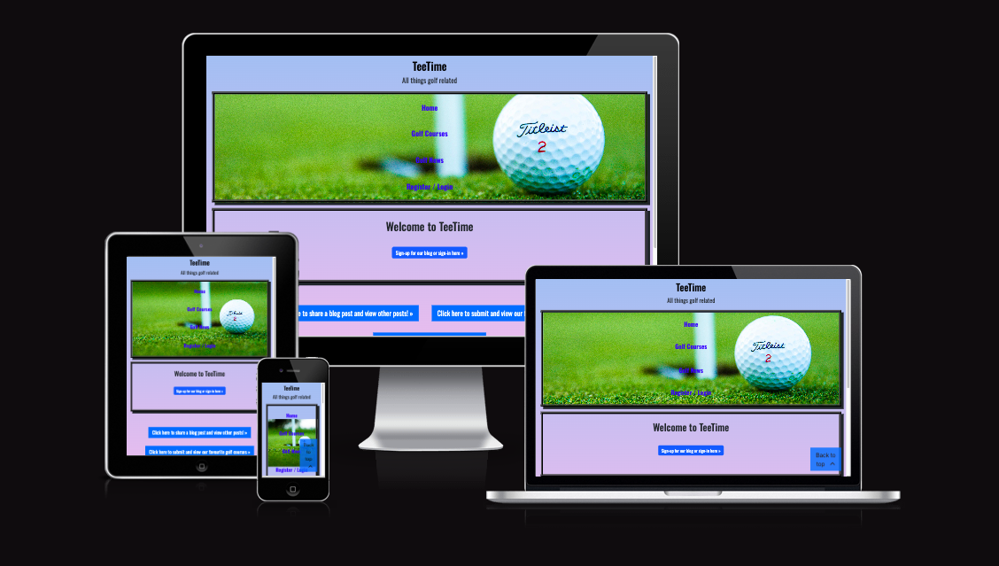
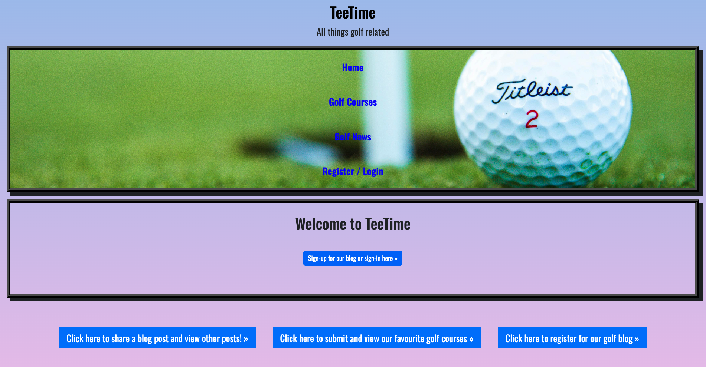
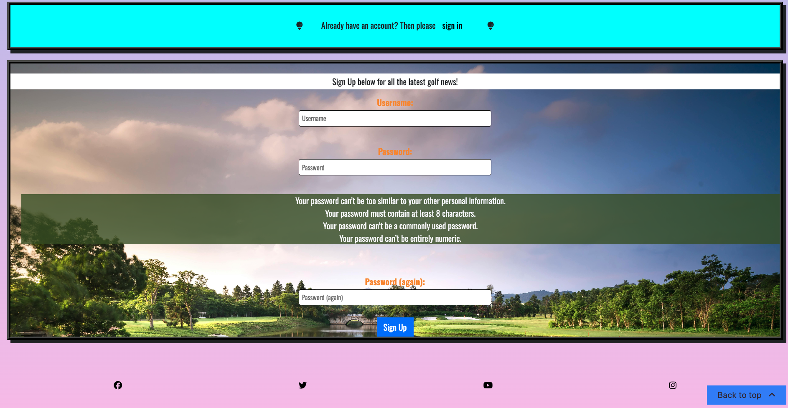
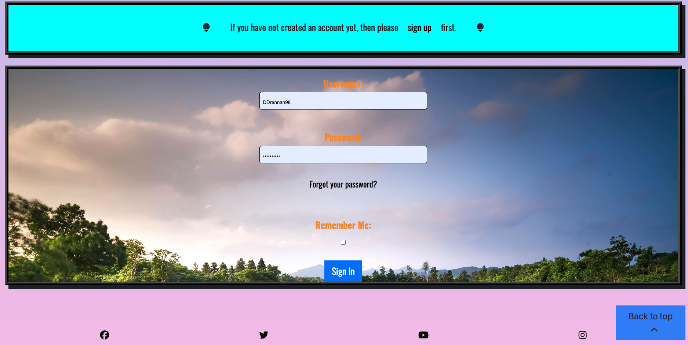

# Welcome to my site on all things golf related called TeeTime

You can find the link to the deployed site here, [TeeTime](https://teetime0000-43f1c39ce1c8.herokuapp.com/).

# Project Purpose

This is the 4th project for the diploma in Full Stack Software Development with Code Institute. TeeTime is a blog where users can interact with eachother, compare favourite golf courses and chat about all things golf. The website will offer users the ability to create, edit delete posts. They will also be able to comment on eachother posts. Think of it as Instagram or Facebook but for golfers. This is a full stack website which incorporates the Django framework. One my main goals is to get people into the game of golf so once users have engaged with content on the site.

# User Experience (UX)

## Project Goals

- Potentially get people into the game of golf. 

- Create a social network for golfers to collaborate and potentially book tee times together. 

- Become a hub for golfers to share all things golf related. 

- Allow users to create, edit and delete posts. 

- Allow users to create and delete comments. 

- Give the ability to users to register, sign in and sign out of the site. 

- Reflect the log in state to the user. 

- Create an easy to navigate, user friendly site. 

## Target Audience

- People who might be looking to take the game of golf up. 

- Golfers of all skill levels. 

- Golfers looking for other people to play with.

# Agile Methodology

## Epics

- Fully functioning site.

- Easy to navigate and intuitive site. 

- A form for signing up on the website. 

- Easy to understand nav bar and also shows whether you're logged in or logged out. 

- Golf course image gallery.

- Database setup. 

## User Stories

1. Create a convenient, easy-to-navigate interface.

2. Complete, Edit and Delete functions. 

3. Views the dates a blog post was created and edited. 

4. Different golf courses. 

5. Liking and commenting other peoples posts. 

6. Signing up for golf newsletter. 

7. Course ratings. 

8. Defensive programming. 

9. Search functions. 

10. Background story of creator. 

## Kanban Board

- I mapped my User Stories onto my Kanban Board on GitHub. I found it very useful for project management and it was easy to identify which features were in the backlog, which features were in progress and which features were ready. My Kanban Board is public and can be viewed in the repository on GitHub but I will attach a screenshot here. 

## MoSCoW Prioritization

- I used MoSCoW prioritization to rank how essential each feature would be. See image below for my user stories and how I labelled them. 

- Must Have labels are essential features. 

- Should Have labels indicated that these features are important but not vital. 

- Could Have labels indicate features that are desirable but not necessary.

- Wont Have labels indicate features that are least critical and will not be implemented. 

- I found that it was an efficient of managing my time and putting my time into the most important part of my project while implementing the most important features first
and working my way down the priority list. 

# Features

## Landing Page

- The TeeTime landing page is simple and easy to navigate. The buttons are big and bright and describe the function of each clearly. The user will have the ability to register an account, sign in with their details, submit one of their favourite golf courses and even share a blog post (note: the user must be signed in to share a post). 

## Navbar and Navbar links

- The TeeTime navbar contains all the navigation links for the different parts of the application. **Home** directs the user to the home page (quick tip: Clicking on **TeeTime** also redirects the user to the home page), **Golf Courses** will direct the user to the golf course submission form where the user can share there favourite golf courses and delete the ones that they don't like. They can also view a list of submitted golf courses. **Golf News** directs the user to one of the most important parts of the application, this is where the user can avail of full Create, Read, Update and Delete (CRUD) functionality. The user can share blog posts, comment on them, delete the ones they're not a fan of and also edit posts to fix those pesky typos. Finally, **Register/Login** is where the user can sign up for the application, give themselves a username and start sharing posts and golf courses. 

## Login Status

- This very simple feature reflects the users login status to them. It's just so the user knows that they're logged in. The user will know they're logged in when it says **Logout** at the bottom of the navbar. 

## Create, Read, Update, Delete (CRUD) Functionality

- This was one of the most important parts of the project but also one of the toughest to get right. I found myself really struggling to get the buttons and features working for this but was without a doubt super rewarding to see it all wired up. If the user clickc **Golf News** or **Click here to share a blog post and view other posts!** they will be allowed to Create a blog post. Then the user can Read the blog post by clicking **View posts here!**, where they will be presented with 3 buttons which control what the user can do with the posts. **Edit post!** controls the Update part of CRUD functionality while **Delete post!** allows the user to delete a blog post. 

## Register / Sign In / Sign Out

- This is the part of the application where the user can register or log into the site. The user will **NOT** be allowed to create and share posts unless they're logged in. The user picks a username, a password and then confirms the password by typing it again. (Note: you might be wondering why you see "Email (optional):" and this is because I changed the account authentication method in settings.py throughout the project and hid the input for email. However, at the time of writing this README, I didn't figure out how to hide the heading for this input, I just figured it was easier to pick a username instead of an email and username). There will be instructions in this form for deciding on a strong password. Just above the sign up form you will see a turquoise box which will enable the user to **sign in** should they already have an acccount. 

- See below for Sign In form. 

- See below for Sign Out screen. The user is asked **are you sure you want to sign out?** just incase they hit the logout button by mistake. 

## Feedback messages to user upon user actions (i.e deleting a post)

- I have implemented feedback messages to the user when they perform certain actions. This reminds me the user of an action they have performed. **See below:**

## Back to top button

- I used some basic JavaScript to create a back to top button which users can click to easily navigate back to the top of the webpage.

# Design

 ### As with my previous projects I went with a very simple design for this project, **the main design features are detailed below:**

- I used a pretty simple [web gradient](https://webgradients.com/) as a background image.

- I used a golf ball background images for my navbar. 

- I gave all divs a consistent border and border styles aswell as some box-shadow. 

- All buttons are underline upon hovering on them. This is so users know that they're hovering over a button. 

## Technologies Used

- HMTL, CSS, JavaScript, Python and Django.

- [Balsamiq Wireframes.](https://balsamiq.com/) 

- Heroku was used for deployment.

- GitHub was used for storing all of my files and READme. 

- Git was used for version control --> "git add . " --> "git commit -m "**message**" --> "git push".

- [Google Fonts was used to import fonts for the project.](https://fonts.google.com/) 

- [PostgreSQL from Code Institute](https://dbs.ci-dbs.net/).

- [The Code Institute database maker was also used](https://dbs.ci-dbs.net/).

- [WebGradients](https://webgradients.com/).

- [Pexels](https://webgradients.com/).

- [Coolors](https://coolors.co/).

- [Table to Markdown](https://tabletomarkdown.com/convert-spreadsheet-to-markdown/).

- Django Aullauth was used for handling the forms and allowing users to register and sign in.

## Typography

- The project portrays the "Oswald" font. I like the simplicity of this one but it also gives the site a more personalised feel. I wanted this to be applied to all so used the "*" selector. You can find this between lines 3-5 in "static/css/style.css". **See steps below to import a font of your choice:**

1. Go to [Google Fonts](https://fonts.google.com/).

2. Scroll through the fonts and select whichever one you like. 

3. Click on the font. 

4. Click "get font" in the top right hand corner. It should be a blue button.

5. Click "get embed code" on the right handside. This is also a blue button. 

6. Embed this code in the head of your HTML file. 

## Color Palette

The main colors I went with for this project are as follows:

1. Grey

2. Black

3. #3E5622

4. Green

5. Blue

6. #30C5FF

7. White

8. Aqua

9. #007bff

10. #F58F29

11. purple (hover pseudo class)

## Wireframes (include different screen sizes)

- Wireframes are basic skeleton guides that show the potential layout of a site and its content. I used Balsamiq to create my wireframes. **See below for some examples:**

## Post Feed Wireframe

## Landing Page Wireframe

## Signup Form Wireframe

## iPad Landing Page Wireframe

## iPhone Landing Page Wireframe

# Testing

## User Story Testing

### User Story 1 - Create a convenient, easy-to-navigate interface
    - Description: Create an application is intuitive and user friendly.
    - Steps:
        1. Navigate the site freely, all buttons and links are displayed clearly.
        2. Hover pseudo classes are applied for accessibility.

### User Story 2 - Create, Edit and Delete Functions
    - Description: Give the user the ability Create, Edit and Delete items.
    - Steps:
        1. Log in or register if you haven't already registered.
        2. Create a post. 
        3. Click "View posts here!".
        4. The user will see 3 options, "Delete Post!", "View Post!" and "Edit Post!".
    - Expected Results: The user can Create, Edit and Delete items which was essential functionality for this project. 

### User Story 3 - View the dates a blog post was created
    - Description: Show the date a post was created on TeeTime. 
    - Steps:
        1. Create a post.
        2. Click "View posts here!".
        3. View the date a post was created. 
    - Expected Results: The user can see the date a post was created. 

### User Story 4 - Different golf courses
    - Description: Create a feature where the users could see list of golf courses submitted to allow comparisons. 
    - Steps:
        1. Click "Golf Courses" in the navbar. 
        2. Click "add a new golf course".
        3. Click "View list of golf courses!".
        4. The user will have the option to delete a course also.
    - Expected Results: View list of submitted golf courses. 

### User Story 5 - Commenting other peoples posts (Future feature)
    - Description: The ability to comment on other users posts. 
    - Steps:
        1. Click "Golf News" or log in and create a post.
        2. Click "View post!" to view the post.
        3. You will see an option to add a comment.  
    - Expected Results: Users can comment on eachothers posts, the comment will show the date of creation and the user who created it. 

### User Story 6 - Signing up for golf newsletter (Will not be implemented at this time)
    - Description: Sign up for a golf newsletter with the latest news from the golf world.  

### User Story 7 - Course ratings (Will not be implmented at this time)
    - Description: Add the ability to rate courses which were submitted by users. 

### User Story 8 - Defensive programming
    - Description: When signing out, the user is asked "Are you sure you want to sign out?" 
    - Steps:
        1. Login or Register using the links provided. 
        2. Click "Logout"
        3. You will see the message "Are you sure you want to sign out?"
    - Expected Results: The user can click "sign out" if they wish. But, this feature is implemented so if they hit "Logout" by accident, they are reminded that they have done so. 

### User Story 9 - Search functions (Will not be implemented at this stage)
    - Description: The ability to search posts created. 

### User Story 10 - Background story of creator (Will not be implemented at this time)
    - Description: Page showcasing the idea behind TeeTime and the background of the creator. 

## Browser Compatibility

- The site works as intended on Google Chrome and Safari. No issuses were reported. 

## Validations

- HTML Validations

| Directory  | File                    | Result |
|------------|-------------------------|--------|
| blog       | create_post.html        | PASS   |
| blog       | edit_post.html          | PASS   |
| blog       | post_detail.html        | PASS   |
| blog       | post_list.html          | PASS   |
| home       | golfcourse_display.html | PASS   |
| home       | golfcourse_detail.html  | PASS   |
| home       | golfcourse_form.html    | PASS   |
| home       | golfcourse_list.html    | PASS   |
| signup     | login.html              | PASS   |
| signup     | logout.html             | PASS   |
| signup     | signup.html             | ***    |

**NOTE for assessor: The signup.html validation returned errors in the generated code by Django, I have no control over this therefore could not resolve it, I hope this is ok.**

- JavaScript validations

- CSS Validationss

Directory	File	Result
static/css	style.css	PASS 

- Python Validations

Directory 	File 	Result
blog	__init__.py	PASS
blog	admin.py	PASS 
blog	apps.py	    PASS 
blog	forms.py	PASS 
blog	models.py	PASS
blog	urls.py	    PASS 
blog	views.py	PASS
		
		
home	__init__.py	PASS
home	admin.py	PASS
home	apps.py	    PASS
home	forms.py	PASS
home	models.py	PASS
home	urls.py	    PASS
home	views.py	PASS
		
		
signup	__init__.py	PASS
signup	admin.py	PASS
signup	apps.py	    PASS
signup	forms.py	PASS
signup	models.py	PASS
signup	urls.py	    PASS
signup	views.py	PASS
		
		
tee_time	__init__.py	PASS
tee_time	asgi.py	    PASS
tee_time	settings.py	PASS
tee_time	urls.py	    PASS
tee_time	wsgi.py	    PASS

## Lighthouse Testing (Desktop and Mobile)

Lighthouse testing is used to analyse a number of different things about a webpage. These can include performance, accessibility, best practices, SEO and Progressive Web App (PWA).

**Here is a breif breakdown of what each audit category assesses:**

1. Performance
    - Measures a pages loading times.
    - Some metrics include Total Blocking Time and Speed Index.
    - Improvements will be suggested.

2. Accessibility 
    - This will check how accessible the web page is to someone with disabilities.
    - Evaluates aspects like the use of semantic HTML. 
    - Improvements will be suggested. 

3. Best Practices
    - Ensures the web page uses modern web development practices. 
    - This will include checks for the correct use of API's.
    - Indicates where the webpage might be using practices which could be considered deprecated. 

4. Search Engine Optimization (SEO)
    - Assess optimization by search engines.
    - Meta tags and valid HTML are just examples of what is analysed here.
    - Provides better visibility in search results. 

5. Progressive Web App (PWA)
    - Checks to see if the webpage meets PWA standards. 
    - Checks for criteria that make the page offline-capable. 
    - Helps with user experience. 

To perform a Lighthouse audit, **please follow these steps:**

1. Inspect your page with Dev Tools. (Right click anywhere on the page and click "Inspect").

2. In the top right hand panel, you will see a list of options, starting with "Elements" and ending with "Application". Click the ">>" button beside "Application" which will show a menu of other options, including Lighthouse. Click on Lighthouse. 

3. Click "Analyze page load". 

- **Here is an example of a Lighthouse audit in my project:**

# Deployment

### The deployment process is done on a platform called Heroku. The deployment process is lengthy but is as follows:

- Create a Heroku account if you haven't done so already. If you're a Code Institute student then you most likely already have one. 

- Create a new app, give the app a unique name and select your region from the options.

- Connect to GitHub (you might be asked to login).

- Select which branch you want to deploy from. 

- Deploy the project. (Enable automatic deploys if you wish for your project to deploy whenever you make a commit).

# Forking

- Forking a repository on GitHub essentially means creating a copy of someone else's project repository. One benefit of this would be that you can make changes to the project without affecting the original repo. To fork a repo, **please follow the below steps:**

1. On GitHub, navigate to the GitHub repository you would like to fork. 

2. In the top right hand corner, you will see a fork button, click this to fork the desired repo. (note: you cannot fork your own repo's so this button will be greyed out on your own repo's).

3. Once you hit the fork button, it will bring you to the **"Create a new fork screen"**. 

4. You can then hit the green **"Create fork"** button. 

# Cloning

- Cloning a repo means copying the entire project repository to your machine. To clone a repo, **please follow the below steps:**

1. Navigate to the repository you want to clone. 

2. Click the green code button. 

3. You will see three subheadings of HTTPS, SSH and GitHub CLI. Copy the URL under the HTTPS subheading. 

4. Open the terminal in your IDE (e.g VS Code or GitPod). 

5. Type the command "git clone" with the URL you copied in the step 3. 

6. Finally, hit Enter. 

# Bugs

- The "Email (optional):" heading still shows in the form even though I have set the input to hidden. At the time of writing this readme, I did not have time to fix this issue. 

# Credits

- Spencer, my mentor for his insight and guidance through what was a huge challenge for me.

- Tomas, for his patience and advice for this project. 

- The Slack community. 

## Notes for assessor

- Could not get the tables to load properly in markdown. Tried using Table to Markdown and generating my table and pasting the result here but it wouldn't work. 